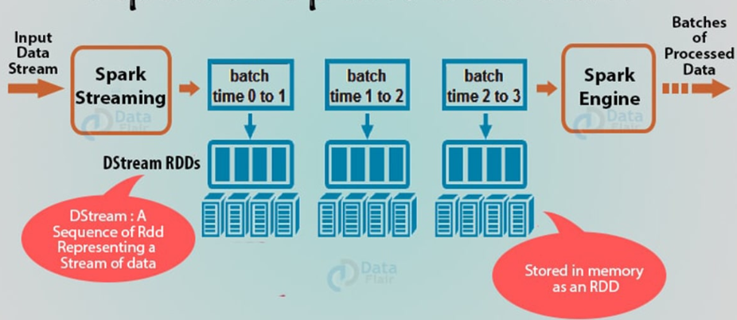

## Spark DStream

作为Apache Spark API的扩展，Spark Streaming是容错的高吞吐量系统。它处理实时数据流。Spark流取得输入来自各种输入可靠来源，如flume，HDFS，和kafka等，并且然后将已处理的数据发送到文件系统，数据库或实时仪表盘。输入数据流被分成批量数据，然后批量生成结果的最终流。

Spark DStream（Discretized Stream）是Spark Streaming的基本抽象。DStream是一个连续的数据流。它接收来自各种来源的输入，如Kafka，Flume，Kinesis或TCP套接字。它也可以是通过转换输入流生成的数据流。DStream的核心是连续的RDD（Spark抽象）流。DStream中的每个RDD都包含来自特定间隔的数据。

DStream上的任何操作都适用于所有底层RDD。DStream涵盖了所有细节。它为开发人员提供了一个高级API，以方便使用。因此，Spark DStream便于处理流数据

Spark Streaming为DStream 提供了与RDD相同的容错属性。只要输入数据的副本可用，它就可以使用RDD的谱系从它重新计算任何状态。默认情况下，Spark会复制两个节点上的数据。因此，Spark Streaming可以承受单个工作者故障

### Spark DStream操作

-   transformation操作     
    DStream中有两种类型的转换： 无状态转换 , 有状态的转变

    *   无状态转换
    每批的处理不依赖于先前批次的数据。无状态转换是简单的RDD转换。它适用于每个批处理，意味着DStream中的每个RDD。它包括常见的RDD转换，如map（），filter()，reduceByKey()等。虽然这些函数看起来像应用于整个流，但每个DStream都是许多RDD（批处理）的集合。因此，每个无状态转换都适用于每个RDD

    *   有状态的转变     
    它使用先前批次的数据或中间结果，并计算当前批次的结果。状态转换是对DStream的操作，可以跨时间跟踪数据。因此，它利用先前批次中的一些数据来生成新批次的结果,两种主要类型是窗口操作，其作用于时间段的滑动窗口，以及updateStateByKey（），其用于跟踪每个键的事件的状态（例如，构建表示每个用户会话的对象）

-   Output操作

    一旦我们在转换后获得数据，就会在Spark Streaming中执行该数据输出操作。在我们程序的调试之后，使用输出操作我们只能保存输出。一些输出操作是print（），save（）等。保存操作将目录保存到文件中，并带有可选的后缀

### 代码举例

~~~python

~~~