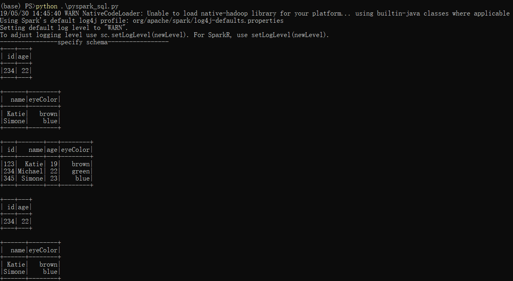

## 关于Spark Sql

Apache Spark SQL将关系处理与Spark函数编程集成在一起。它是用于结构化数据处理的Spark模块。spark sql模糊了RDD和关系表之间的界限。它还通过与 Spark代码集成的声明性DataFrame Api, 在关系处理和过程处理之间提供了更紧密的集成。
因此, 它提供了更高的优化。DataFrame API和DataSet API是与Spark SQL交互的方法。因此, 使用Spark SQL, Apache Spark可供更多用户访问, 并改进了当前用户的优化

spark SQL在Spark Core的基础上运行。它允许开发人员从Hive表和parquet文件导入关系数据, 对导入的数据和现有的Rdd运行SQL查询, 并轻松地将Rdd写入 Hive表或Parquet文件。因为Spark SQL提供了DataFrame Api, 它对外部数据源和Spark内置分布式集合执行关系操作。Spark SQL引入了称为Catalyst的可扩展优化器, 因为它有助于支持 Bigdata 中的各种数据源和算法

### Spark SQL Interfaces - 接口

-   DataFrame      
    Spark DataFrames像Apache Spark中的RDD Transformations一样惰性执行。DataFrame等效于Spark SQL中的关系表,DataFrame将数据存储到表中。 
    DataFrame与关系数据库中的表类似，但具有更丰富的优化,它是一种适用于结构和半结构化数据的数据抽象和特定于域的语言（DSL）,是命名列和行形式的分布式数据集合,访问DataFrame，需要SQL上下文或Hive上下文。

-   SQLContext  
    它是在Apache Spark中处理结构化数据（行和列）的入口点,它允许创建DataFrame对象以及执行SQL查询。

-   Hive Context
    使用Hive表，SQLContext的子类。Hive context经过充分测试，并提供比SQLContext更丰富的功能

-   DataSets     
    DataSets提供了更好的RDDS。例如，映射到已存在的关系模式的强类型，不可变的对象集合。数据集扩展了编译时类型安全的好处（它可以在错误运行之前分析应用程序）,它还允许对用户定义的类进行直接操作。

-   JDBC Datasource    
    在Apache Spark中，JDBC数据源可以使用JDBC API从关系数据库中读取数据。它优先于RDD，因为数据源将结果作为DataFrame返回，可以在Spark SQL中处理，也可以在其他数据源添加。

-   Catalyst Optimizer
    Catalyst包含了一个表示树和操作树的规则的通用库。在此框架下，目前实现了针对关系查询处理(如，表达式，逻辑查询计划)的库，和在处理查询执行不同阶段(分析，逻辑优化，物理优化，代码生成)的一些规则。

### Spark SQL特性

-   Integrated - 集成    
    逻辑上将SQL查询与Spark程序混合在一起。Apache Spark SQL允许使用SQL或Java，Scala，Python和R中的DataFrame API在Spark程序中查询结构化数据.

-   Uniform Data Access - 统一数据访问
    在Spark DataFrames和SQL中，支持访问各种数据源的常用方法，如Hive，Avro，Parquet，ORC，JSON和JDBC。因此，Spark SQL可以跨这些源连接数据

-   Hive兼容性     
    对当前数据运行未修改的Hive查询。Spark SQL重写Hive前端和元存储，允许与当前Hive数据，查询和UDF完全兼容

-   标准连接    
    通过JDBC或ODBC连接。支持行业规范的服务器，用于商业智能工具的JDBC和ODBC连接

-   性能和可伸缩性    
    Apache Spark SQL结合了基于成本的优化器，代码生成和列式存储，使查询变得灵活，同时使用Spark引擎计算数千个节点，从而提供完整的中间查询容错能力

### 实际代码

~~~python
from pyspark.sql import SparkSession 
from pyspark.sql import Row
from pyspark.sql.types import StructType, StructField, LongType, StringType

# 创建SparkSession 对象
spark=SparkSession.builder.appName('my_app_name').getOrCreate()

# 另外一种创建方式,向SparkSession传递一个SparkContext
# sc = SparkContext.getOrCreate()
# spark = SparkSession(sc)

# json - sql 
def read_json_sql():
    # 构造用于测试的Json数据
    stringJSONRDD = spark.sparkContext.parallelize((
    """{"id": "123","name": "Katie","age": 19,"eyeColor": "brown"}""",
    """{"id": "234","name": "Michael","age": 22,"eyeColor": "green"}""", 
    """{"id": "345","name": "Simone","age": 23,"eyeColor": "blue"}""")
    )
    # 创建DataFrame
    swimmersJSON = spark.read.json(stringJSONRDD)
    # DataFrame 注册为临时表 swimmersJSON
    swimmersJSON.createOrReplaceTempView("swimmersJSON")
    # DataFrame API 查看数据
    swimmersJSON.show()

    # 使用SQL查询
    data=spark.sql("select * from swimmersJSON").collect()  # sql函数返回的 DataFrame对象
    for i in data:             # 对于data中的每行是 Row类型,数据内容像键值对。
        print(i['eyeColor'])
    swimmersJSON.printSchema() # 查看模型树 

# 指定dataframe中的schema
def specify_schema():
    stringCSVRDD = spark.sparkContext.parallelize([(123, 'Katie', 19, 'brown'), (234, 'Michael', 22, 'green'), (345, 'Simone', 23, 'blue')])
    schema = StructType([
        StructField("id", LongType(), True),    
        StructField("name", StringType(), True),
        StructField("age", LongType(), True),
        StructField("eyeColor", StringType(), True)
    ])

    swimmers = spark.createDataFrame(stringCSVRDD, schema)  # 创建 DataFrame，并指定schema
    swimmers.createOrReplaceTempView("swimmers")    # 构建临时表swimmers
    spark.sql("SELECT id , age , eyecolor FROM swimmers").show()   # 选择对应的列
    spark.sql("select count(*) cnt from swimmers").show()   # 使用聚合函数 
    spark.sql("select id, age from swimmers where age = 22").show()  # 使用where子句
    spark.sql("select name, eyeColor from swimmers where eyeColor like 'b%' ").show()  # 使用like子句
    # --------------- 和spark sql 同样效果的 DataFrame API ------------------
    swimmers.show()
    swimmers.count()
    swimmers.select("id","age").filter("age=22").show()
    swimmers.select("name", "eyeColor").filter("eyeColor like 'b%'").show()

# 多表操作
def multi_table_query():
    # 构建航班信息表，从文件airport-codes-na.txt文件中
    airportsFilePath = "airport-codes-na.txt"
    airports = spark.read.csv(airportsFilePath, header='true', inferSchema='true', sep='\t')
    airports.createOrReplaceTempView("airports") 

    # 构建航班延误表，从文件departuredelays.txt文件中
    flightPerfFilePath = "departuredelays.csv"
    flightPerf = spark.read.csv(flightPerfFilePath, header='true')
    flightPerf.createOrReplaceTempView("FlightPerformance")
    flightPerf.cache()

    spark.sql("select a.City, f.origin, sum(f.delay) as Delays from FlightPerformance f  \
               join airports a on a.IATA = f.origin  \
               where a.State = 'WA' group by a.City, f.origin order by sum(f.delay) desc").show()

    spark.sql("select a.State, sum(f.delay) as Delays from FlightPerformance f  \
              join airports a on a.IATA = f.origin  \
              where a.Country = 'USA' group by a.State ").show()

if __name__ == "__main__":
    read_json_sql()
    specify_schema()
    multi_table_query()
~~~

