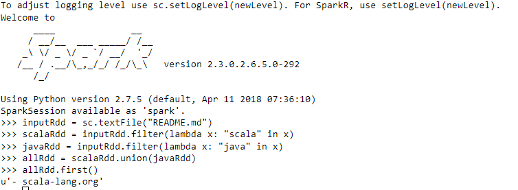
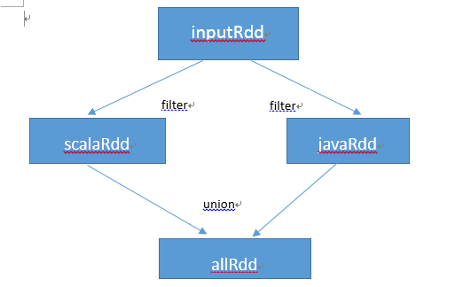

---
title ： Spark中常见的一些RDD操作
---

## 总的来说，每个 Spark 程序或shell会话都按如下方式工作。

-   从外部数据创建出输入 RDD。
-   使用诸如 filter() 这样的转化操作对 RDD 进行转化，以定义新的 RDD。
-   告诉 Spark 对需要被重用的中间结果 RDD 执行 persist() 操作。
-   使用行动操作（例如 count() 和 first() 等）来触发一次并行计算， Spark 会对计算进行优化后再执行

## 创建RDD
Spark 提供了两种创建 RDD 的方式：读取外部数据集，以及在驱动器程序中对一个集合进行并行化

创建RDD最简单的方式就是把程序中一个已有的集合传给SparkContext的parallelize()方法,除了开发原
型和测试时， 这种方式用得并不多，毕竟这种方式需要把你的整个数据集先放在一台机器的内存中

-    Python 中的 parallelize() 方法
~~~python
lines=sc.parallelize(["pandas","i like pandas"])
~~~

-   Scala 中的 parallelize() 方法
~~~scala
val lines = sc.parallelize(List("pandas", "i like pandas"))
~~~

-   java 中的 parallelize() 方法
~~~java
JavaRDD<String> lines = sc.parallelize(Arrays.asList("pandas", "i like pandas"));
~~~

更常用的方式是从外部存储中读取数据来创建RDD,在前面的介绍中使用了textFile()函数,其他更多的函数在后续说明。

## RDD的操作类型

RDD支持两种操作：transformation操作和Action操作。RDD的transfrmation操作是返回一个新的RDD的操作，比如map()和filter()，而行Action作则是向驱动器程序返回结果或把结果写入外部系统的操作，会触发实际的计算，比如count()和first()。

### Transformations操作

RDD 的transformations操作是返回新RDD的操作。且transformations RDD 是惰性求值的，只有在行动操作中用到这些RDD时才会被计算。许多转化操作都是针对各个元素的，也就是说，这些转化操作每次只会操作 RDD 中的一个元素

-   以下使用textFile()函数；filter转换函数过滤数据；使用union函数合并数据
~~~python
inputRdd = sc.textFile("README.md")
scalaRdd = inputRdd.filter(lambda x: "scala" in x)
javaRdd = inputRdd.filter(lambda x: "java" in x)
allRdd = scalaRdd.union(javaRdd)
~~~

-   通过转化操作，你从已有的 RDD 中派生出新的 RDD， Spark 会使用谱系图（lineage graph）来记录这些不同 RDD 之间的依赖关系,如下图所示。

### Actions操作
我们已经看到了如何通过转化操作从已有的 RDD 创建出新的 RDD，不过有时，我们希望对数据集进行实际的计算。 行动操作是第二种类型的 RDD 操作，它们会把最终求得的结果返回到驱动器程序， 或者写入外部存储系统中。

-   用count()来返回计数结果，用take()来收集RDD中的一些元素

~~~python
print "Input had " + str(allRdd.count()) + " concerning lines"
print "Here are 10 examples:"
for line in allRdd.take(10):
    print line
~~~

### lazy计算（延迟计算）

RDD 的转化操作都是惰性求值的。这意味着在被调用行动操作之前 Spark 不会开始计算。这对新用户来说可能与直觉有些相违背之处，惰性求值意味着当我们对 RDD 调用转化操作（例如调用 map()）时，操作不会立即执行。相反，Spark会在内部记录下所要求执行的操作的相关信息。
我们不应该把 RDD 看作存放着特定数据的数据集，而最好把每个RDD当作我们通过转化操作构建出来的、记录如何计算数据的指令列表。 把数据读取到 RDD 的操作也同样是惰性的。
因此，当我们调用sc.textFile() 时，数据并没有读取进来，而是在必要时才会读取。和转化操作一样的是，读取数据的操作也有可能会多次执行

## 向Spark传递函数
Spark的大部分转化操作和一部分行动操作，都需要依赖用户传递的函数来计算。

### Python 
在Python中，我们有三种方式来把函数传递给 Spark。传递比较短的函数时，可以使用lambda 表达式来传递。除了lambda表达式，可以外部函数或是定义的局部函数

~~~python
word = rdd.filter(lambda s: "error" in s)
def containsError(s):
    return "error" in s
word = rdd.filter(containsError)
~~~

>>>传递函数时需要小心的一点是， Python 会在你不经意间把函数所在的对象也序列化传出去。当你传递的对象是某个对象的成员， 或者包含了对某个对象中一个字段的引用时（例如 self.field）， Spark 就会把整个对象发到工作节点上，这可能比你想传递的东西大得多,如下所示：
~~~python
class SearchFunctions(object):
    def __init__(self, query):
        self.query = query
    def isMatch(self, s):
        return self.query in s
    def getMatchesFunctionReference(self, rdd):
        # 问题：在"self.isMatch"中引用了整个self
        return rdd.filter(self.isMatch)
    def getMatchesMemberReference(self, rdd):
        # 问题：在"self.isMatch"中引用了整个self
        return rdd.filter(lambda x: self.query in x)
~~~

修改为
~~~python
class WordFunctions(object):
...
    def getMatchesNoReference(self, rdd):
        # 安全：只把需要的字段提取到局部变量中
        query = self.query
        return rdd.filter(lambda x: query in x)
~~~