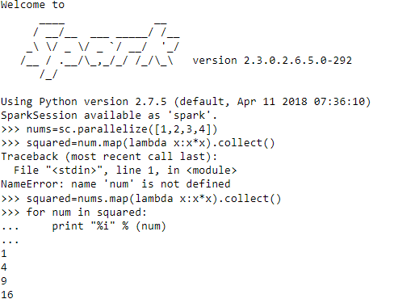
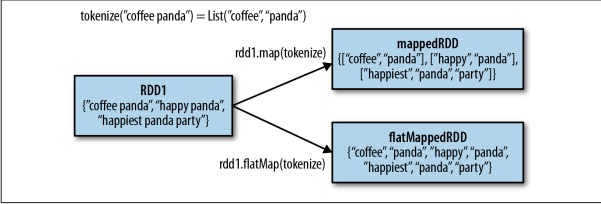

## 常见transformation和action操作
在这里接触Spark中大部分常见的转化操作和行动操作。包含特定数据类型的RDD还支持一些附加操作，例如，数字类型的RDD支持统计型函数操作，而键值对形式的RDD则支持诸如根据键聚合数据的键值对操作。我们也会在后面几节中讲到如何转换RDD类型，以及各类型对应的特殊操作。

### 基本transformation操作

很可能会用到的两个最常用的转化操作是map()和filter()。转化操作map()接收一个函数，把这个函数用于RDD中的每个元素，将函数的返回结果作为结果。RDD中对应元素的值。而转化操作filter()则接收一个函数，并将RDD中满足该函数的元素放入新的RDD中返回

#### map()函数

转化操作map()接收一个函数，把这个函数用于 RDD 中的每个元素，将函数的返回结果作为结果,RDD 中对应元素的值。而转化操作 filter()则接收一个函数，并将RDD中满足该函数的元素放入新的RDD中返回。ap() 的返回值类型不需要和输入类型一样

~~~python
nums = sc.parallelize([1, 2, 3, 4])
squared = nums.map(lambda x: x * x).collect()
for num in squared:
    print "%i " % (num)
~~~

#### flatmap()

希望对每个输入元素生成多个输出元素。实现该功能的操作叫作 flatMap()。和map()类似，提供给flatMap()的函数被分别应用到了输入RDD的每个元素上。不过返回的不是一个元素，而是一个返回值序列的迭代器。输出的RDD倒不是由迭代器组成的。我们得到的是一个包含各个迭代器可访问的所有元素的RDD。flatMap()的一个简单用途是把输入的字符串切分为单词

~~~python
lines = sc.parallelize(["hello world", "hi"])
words = lines.flatMap(lambda line: line.split(" "))
words.first() # returns "hello"
~~~

flatMap() 和 map() 的区别。你可以把flatMap()看作将返回的迭代器降维展开，这样就得到了一个由各列表中的元素组成的 RDD，而不是一个由列表组成的RDD

#### 伪集合操作

尽管RDD本身不是严格意义上的集合，但它也支持许多数学上的集合操作，比如合并和相交操作。注意，这些操作都要求操作的RDD是相同数据类型的

-   即通常数学上定义的 交集，并集，差集,笛卡尔积等。如下表所示。

|函数|目的|示例|返回值|
|-----|-----|------|-----|
|union()|并集,生成一个包含两个RDD中所有元素的RDD|rdd.union(other)|{1, 2, 3, 3, 4, 5}|
|intersection()|交集,求两个 RDD 共同的元素的RDD|rdd.intersection(other) {3}|
|subtract()|差集,移除一个RDD中的内容（例如移除训练数据）|rdd.subtract(other)|{1, 2}|
|cartesian()|笛卡尔积,与另一个RDD 的笛卡儿积|rdd.cartesian(other)|{(1, 3), (1, 4), ...(3, 5)}|

-   RDD转化操作

|函数|功能|示例|返回值|
|-----|-----|------|-----|
|map()|将函数应用于RDD中的每个元素，将返回值构成新的RDD|rdd.map(x => x + 1)|{2, 3, 4, 4}|
|flatMap()|将函数应用于RDD中的每个元素,将返回值构成新的RDD|rdd.flatMap(x => x.to(3))|{1, 2, 3, 2,3, 3, 3}|
|filter()|返回一个由通过传给filter()的函数的元素组成的RDD|rdd.filter(x => x != 1)|{2, 3, 3}|
|distinct()|去重|rdd.distinct()|{1, 2, 3}|
|sample(withReplacement, fraction, [seed])|对 RDD 采样，以及是否替换|rdd.sample(false, 0.5)|不确定|

### Action操作

可能会用到基本RDD上最常见的Action操作是reduce()。它接收一个函数作为参数，这个函数要操作两个RDD的元素类型的数据并返回一个同样类型的新元素。一个简单的例子就是函数+，可以用它来对我们的RDD进行累加。使用reduce()，可以很方便地计算出 RDD中所有元素的总和、元素的个数，以及其他类型的聚合操作

~~~python
sum = rdd.reduce(lambda x, y: x + y)
~~~

|函数|目的|示例|返回值|
|-----|-----|------|-----|
|collect()|返回RDD 中的所有元素|rdd.collect()|{1, 2, 3, 3}|
|count()|RDD中的元素个数|rdd.count()|4|
|countByValue()|各元素在RDD中出现的次数|rdd.countByValue() {(1, 1),(2, 1),(3, 2)}|
|take(num)|从RDD中返回num个元素|rdd.take(2)|{1, 2}|
|top(num)|从RDD中返回最前面的num个元素|rdd.top(2) {3, 3}|
|takeOrdered(num)(ordering)|从RDD中按照提供的顺序返回最前面的num个元素|rdd.takeOrdered(2)(myOrdering)|{3,3}|
|takeSample(withReplacement, num, [seed])|从RDD 中返回任意一些元素|rdd.takeSample(false, 1)|非确定的|
|reduce(func)|并行整合RDD中所有数据（例如 sum）|rdd.reduce((x, y) => x + y)|9|
|fold(zero)(func)|和reduce()一 样，但是需要提供初始值|rdd.fold(0)((x, y) => x + y)|9|
|aggregate(zeroValue)(seqOp, combOp)|和reduce()相似，但是通常返回不同类型的函数|rdd.aggregate((0, 0))|((x, y) =>(x._1 + y, x._2 + 1),(x, y) =>(x._1 + y._1, x._2 + y._2))|(9,4)|
|foreach(func)|对RDD中的每个元素使用给定的函数|rdd.foreach(func)|无|

>> 使用 aggregate() 时，需要提供我们期待返回的类型的初始值。然后通过一个函数把 RDD 中的元素合并起来放入累加器。考虑到每个节点是在本地进行累加的，最终，还需要提供第二个函数来将累加器两两合并

## 数据持久化