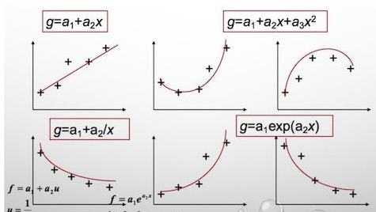

## 推荐系统 

自动推荐内容或产品以个性化的方式向适当的用户提供,以增强整体体验。推荐系统在术语上非常强大使用海量的数据,学会理解偏好。

对于PySpark中的“推荐系统”模块 **pyspark.ml.recommendation module**        
[官方文档链接：api/python/pyspark.ml.html#module-pyspark.ml.recommendation](http://spark.apache.org/docs/latest/api/python/pyspark.ml.html#module-pyspark.ml.recommendation)

## spark 推荐系统的ALS 算法

* 交替最小平方 (ALS) 矩阵分解:                  
ALS 尝试将评级矩阵 R 估计为两个较低级别矩阵(X 和 Y,即 X = Yt = R)的乘积。一般方法是迭代。在每次迭代期间,一个因子矩阵保持不变,而另一个因子矩阵使用最小二乘求解。然后,在求解另一个因子矩阵时,新求解的因子矩阵保持不变。

* 现实场景到推荐系统模型的转换 ; 构建模型 中的转换关系
  * 划分出推荐系统中参与的对象,如在线购物网站中，参与的主要对象是购物者和相关的商品。
  * 将这些对象的按维度属性进行划分，通过这些维度属性可以有效的表示这个对象。如购物者可以通过 年龄，性别，所住城市等这些属性进行表示。
  * 将对象通过对应的属性维度构建好后。假设每个对象可以通过一个函数表示,如: ax1 + bx2 + cx3 + dx4 = y 。为每个对象，依据分配的属性维度个数，构建有相同元的函数。
  * 通过不同对象个体的属性维度值构建矩阵,构建好不同对象的矩阵后，进行矩阵相乘。得到的新矩阵可以认为是每个购物者对相关物品的关联程度。
  * 由于对象的函数表示，是通过假设的，所以需要获取最优函数的办法，即通过使用最小二乘法来获取最佳函数。

* 关于最小二乘法：   
    它通过最小化误差的平方和寻找数据的最佳函数匹配。利用最小二乘法可以简便地求得未知的数据，并使得这些求得的数据与实际数据之间误差的平方和为最小。
最小二乘法还可用于曲线拟合。其他一些优化问题也可通过最小化能量或最大化熵用最小二乘法来表达。

    通俗的说：在平面(也可再高维度空间种)上有若干点，需要使用一个函数来表示这些点；如何确定这个函数是最优的；通过在坐标系上，每个点到这个函数对应的图形的距离的和最小，
由于拟合函数可以有很多种，但是求两点的具体方法：坐标值差的平方的和，后再开方。 把这些值都加起来后求最小情况，就是最小二乘法。

使用最小二乘法的，不同拟合曲线：

## 推荐系统的分类

**协同计算**        
    基于用用户评级和其他用户的行为，用相似行为的用户喜好与购买商品进行推荐，（人的口味会变吗？过去喜欢类型的电影，现在是否还喜欢）。

**基于内容的过滤**      
    使用属性描述商品，（类目，品牌，价格，尺码，颜色，图片），然后找出类似的商品，可以用余弦距离或者皮尔逊相关系数，测量商品的距离（相似度）然后将用户资料输入方程式，鉴于用户喜欢的类型进行反馈

**混合方法** 
    