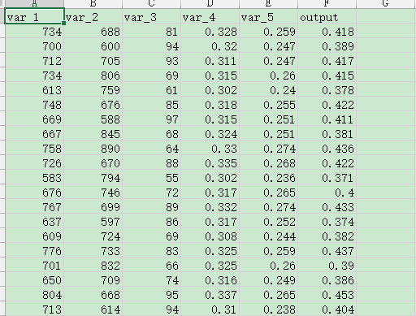
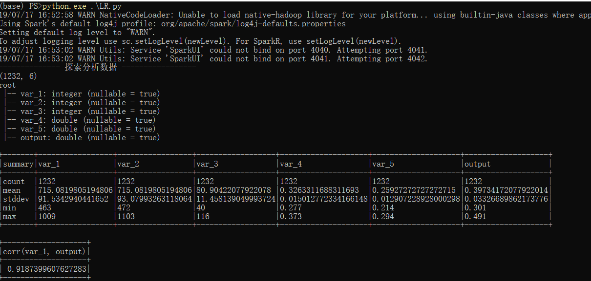
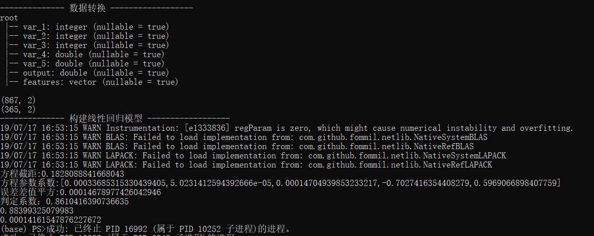

### 变量的类型

* 类别数据（定性数据）
  数据被划分为各种类别，用以描述某类的性质户特征，因此也称为定性数据。对于类别数据不要将其理解为数字。（如甜品的种类）。

* 数值数据（定量数据）
  数值型数据具有数字的意义，还涉及计量或计数（如长度和时间）。

### 算法举例

线性回归的总体目标是预测直线通过数据, 使每个点的垂直距离是最小的到该预测线。以下通过计算材料电阻的方法进行说明。
电阻公式 ：R=ρL/S (ρ导体材料的电阻率,L为导体的长度,S为导体的横截面积)

有不同长的材料，其横截面相同，对一些已知长度的材料其电阻值已经，通过这些信息，计算其他任意长度的材料的电阻值。

|编号|材料长度|电阻值|
|----|-----|-----|
|1|1|2.4|
|2|2|4.9|
|3|3|7.3|
|4|4|9.1|

* squared errors - 均方误差    
是反映估计量与被估计量之间差异程度的一种度量

* 协方差（Covariance）   
在概率论和统计学中用于衡量两个变量的总体误差。而方差是协方差的一种特殊情况，即当两个变量是相同的情况

协方差表示的是两个变量的总体的误差，这与只表示一个变量误差的方差不同。 如果两个变量的变化趋势一致，也就是说如果其中一个大于自身的期望值，另外一个也大于自身的期望值，那么两个变量之间的协方差就是正值。 如果两个变量的变化趋势相反，即其中一个大于自身的期望值，另外一个却小于自身的期望值，那么两个变量之间的协方差就是负值。

* TSS , SSE , SSR 

  TSS = SSE + SSR 
  TSS  -  Total Sum of Squared Errors  平方误差的总和   -   使用均值进行计算。    
  SSE  -  Sum of squared errors        平方误差之和     -   计算得到斜率公式，重新计算需要预测的值。 - 残差平方和    
  SSR  -  Residual Sum of squared errors  平方误差的剩余总和  - 回归平方和   

  meanSquaredError - 均方误差（mean-square error, MSE）是反映估计量与被估计量之间差异程度的一种度量

  判定系数(拟合优度) - SSR / TSS  计算求得 确定系数，越大，说明预测的准确率越高。     

-   计算过程
    * 求斜率和截距 （通过均值代理计算）- 通过协方差进行计算 
    * 计算确定系数，用来评估准确性。

### 实际代码

用于测试的数据的样式：  

~~~python
from pyspark.sql import SparkSession
spark=SparkSession.builder.appName('lin_reg').getOrCreate()

# 2-读取数据
from pyspark.ml.regression import LinearRegression
df=spark.read.csv('Linear_regression_dataset.csv',inferSchema=True,header=True)

# 3-探索分析数据
print('-------------- 探索分析数据 -----------------')
print((df.count(), len(df.columns)))                 # 查看数据规模
df.printSchema()  						             # 查看数据结构类型
df.describe().show(5,False)                          # 查看数据集的统计数据,包括平均值，标准差，数量统计等。
from pyspark.sql.functions import corr
df.select(corr('var_1','output')).show()             # 计算数据方差

# 4-数据转换,适应模型算法中的要求
from pyspark.ml.linalg import Vector
from pyspark.ml.feature import VectorAssembler       # 导入库VectorAssembler

print('-------------- 数据转换 ------------------')
vec_assmebler=VectorAssembler(inputCols=['var_1', 'var_2', 'var_3', 'var_4', 'var_5'],outputCol='features') # 转换，这里相对将多元一次方程中的各变量存放到一个向量中
features_df=vec_assmebler.transform(df)             

features_df.printSchema() # 查看变换后的结构。

model_df=features_df.select('features','output')     # 构建用于线性回归的数据模型

# 5-将数据划分为 训练数据和预测数据
train_df,test_df=model_df.randomSplit([0.7,0.3])     # 训练数据和预测数据的比例为 7比3

print((train_df.count(), len(train_df.columns)))

print((test_df.count(), len(test_df.columns)))

# 6-构建线性回归模型

from pyspark.ml.regression import LinearRegression         # 导入线性回顾库

print('-------------- 构建线性回归模型 ------------------')

lin_Reg=LinearRegression(labelCol='output')                 # labelCol,相对于featrues列，表示要进行预测的列

lr_model=lin_Reg.fit(train_df)                              # 训练数据 ，fit返回一个 fitted model，即LineRegressionModel对象

print('{}{}'.format('方程截距:',lr_model.intercept))         # intercept 线性方程的截距。

print('{}{}'.format('方程参数系数:',lr_model.coefficients))  # 回归方程中的，变量参数 ,这里分别对应var_1,var_2,var_3,var_4,var_5

training_predictions=lr_model.evaluate(train_df)            # 查看预测数据

print('{}{}'.format('误差差值平方:',training_predictions.meanSquaredError))            # 误差值差值平方   

print('{}{}'.format('判定系数：',training_predictions.r2 ))  # r2 判定系数,用来判定，构建的模型是否能够准确的预测,越大说明预测的准确率越高

# 7-使用预测数据,用已经到构建好的预测模型 lr_model
test_results=lr_model.evaluate(test_df)

print(test_results.r2)   							# 查看预测的拟合程度
print(test_results.meanSquaredError)                # 查看均方误差
~~~

**执行结果**

