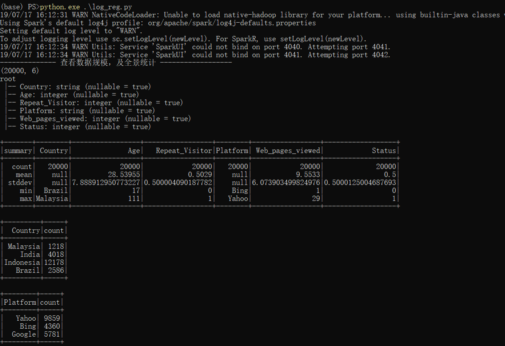
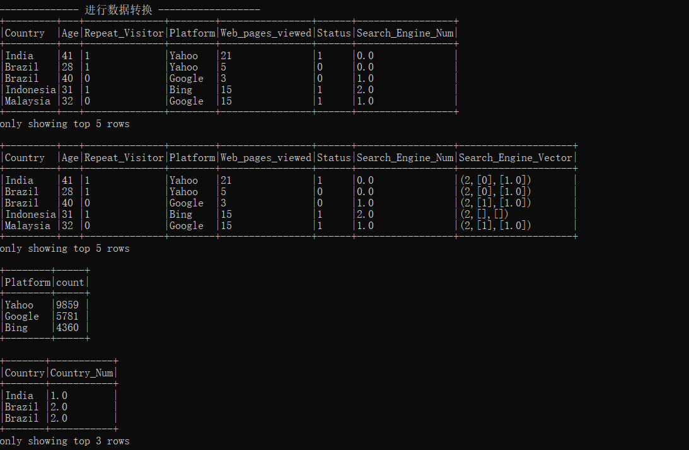
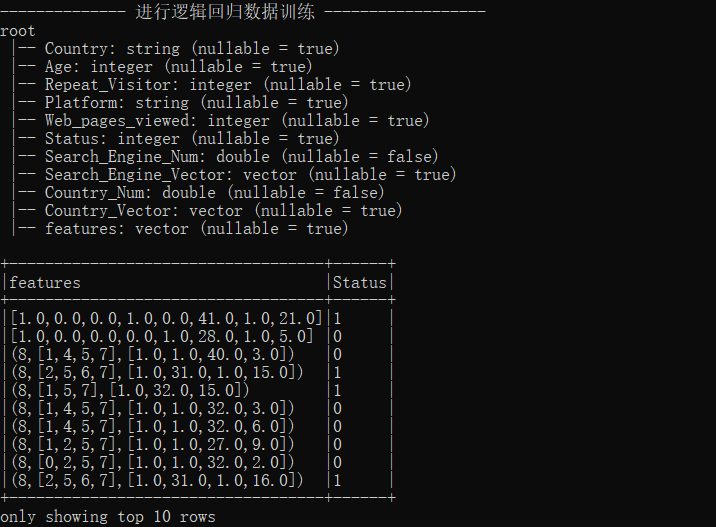
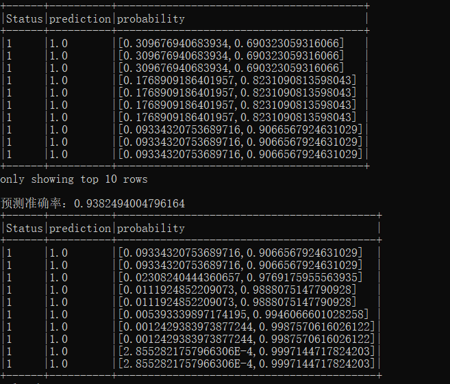

## Logit模型

Logit模型（Logit model，也译作“评定模型”，“分类评定模型”，又作Logistic regression，“逻辑回归”）是离散选择法模型之一，Logit模型是最早的离散选择模型，也是目前应用最广的模型

逻辑回归属于分类算法。逻辑回归可以进行多分类操作，但由逻辑回归算法本身性质决定其更常用于二分类,即: 对-错,好-坏等

### 逻辑回归的公式：

其中，Y为决策值，x为特征值，e为自然对数。

该函数是一条S形的曲线，并且曲线在中心点附近的增长速度较快，在两段的增长速度较慢。w值越大，曲线中心的增长速度越快。从图上可知，Y的值域为(0,1)，
那么就可以将决策函数值大于等于0.5的具有对应x属性的对象归为正样本，决策函数值小于0.5的具有对应x属性的对象归为负样本。这样就可以对样本 数据进行二分类。

使用的测试数据为-不同国家的人通过不同的搜索引擎查找访问网站的数据,数据的表头如下:

### 代码示例

~~~python
from pyspark.sql import SparkSession
spark=SparkSession.builder.appName('log_reg').getOrCreate()

# 读取测试数据
df=spark.read.csv('Log_Reg_dataset.csv',inferSchema=True,header=True)

from pyspark.sql.functions import *

# 1 - 查看数据情况，检测数据质量和相关的特征。即相对数据有一定的认识，对后续进行逻辑回归训练做准备
#     包括的操作如下。

print('-------------- 查看数据规模，及全景统计 ------------------')

print((df.count(),len(df.columns)))  # 查看数据数据规模 - 输出为 (20000,6) 表是有 2万行数据，有6列 

df.printSchema()                     # 查看数据结构 

df.columns                           # 查看列名

df.describe().show()                 # 全景数据分析统计，会对各列按 平均值，方差，最小值，最大值 , 函数统计 这几个统计量来进行统计。

## 统计信息,使用API进行调用，使用Spark Sql可以达到相同的效果。

df.groupBy('Country').count().show()   

df.groupBy('Platform').count().show()   

df.groupBy('Status').count().show()   

# 2 - 进行数据转换，主要将类别数据，转换为可通过数值来度量
# 包括对字符串(类型变量)转换为可度量

print('-------------- 进行数据转换 ------------------')

from pyspark.ml.feature import StringIndexer   # StringIndexer可以把字符串的列按照出现频率进行排序，出现次数最高的对应的Index为0

## 2.1 将字符串转换为可度量值 
search_engine_indexer = StringIndexer(inputCol="Platform", outputCol="Search_Engine_Num").fit(df)    # 返回对应的模型,即StringIndexerModel
df = search_engine_indexer.transform(df)       # 输入的dataset进行模型转换,返回经过转换后的dataset

df.show(5,False)

## 2.2 进行独热编码
from pyspark.ml.feature import OneHotEncoder # OneHotEncoder 它可以实现将分类特征的每个元素转化为一个可以用来计算的值

## 对使用的搜索引擎独热编码
search_engine_encoder = OneHotEncoder(inputCol="Search_Engine_Num", outputCol="Search_Engine_Vector")
df = search_engine_encoder.transform(df)

df.show(5,False)

df.groupBy('Platform').count().orderBy('count',ascending=False).show(5,False)

## 对城市独热编码 
country_indexer = StringIndexer(inputCol="Country", outputCol="Country_Num").fit(df)
df = country_indexer.transform(df)
df.select(['Country','Country_Num']).show(3,False)

country_encoder = OneHotEncoder(inputCol="Country_Num", outputCol="Country_Vector")
df = country_encoder.transform(df)

# 3 - 进行逻辑回归数据训练

print('-------------- 进行逻辑回归数据训练 ------------------')

from pyspark.ml.feature import VectorAssembler     # 导入VerctorAssembler 将多个列合并成向量列的特征转换器,即将表中各列用一个类似list表示，输出预测列为单独一列。

## 3.1 将经过进行量化后的platform,country和原来的Age，Repeat_Visitor ，Web_pages_viewed 构成特征向量
df_assembler = VectorAssembler(inputCols=['Search_Engine_Vector','Country_Vector','Age', 'Repeat_Visitor','Web_pages_viewed'], outputCol="features")
df = df_assembler.transform(df)

## 查看构建后的数据

df.printSchema()
df.select(['features','Status']).show(10,False)
model_df=df.select(['features','Status'])

## 3.2 进行逻辑回归

from pyspark.ml.classification import LogisticRegression                            # 逻辑回归。该类支持多项逻辑(softmax)和二项逻辑回归

training_df,test_df=model_df.randomSplit([0.75,0.25])                               # 划分数据，75%的数据用于训练，25%数据用于验证测试

training_df.groupBy('Status').count().show()                                        # 查看划分后的数据
test_df.groupBy('Status').count().show()

log_reg=LogisticRegression(labelCol='Status').fit(training_df)                      # 返回LogisticRegressionModel类型模型对象

train_results=log_reg.evaluate(training_df).predictions                             # 在测试数据集中评估模型,返回对象为BinaryLogisticRegressionSummary-给定模型的二元逻辑回归结果

train_results.filter(train_results['Status']==1).filter(train_results['prediction']==1).select(['Status','prediction','probability']).show(10,False)

print('{}{}'.format('预测准确率：',log_reg.evaluate(training_df).accuracy) )         # 查看预测的准确率

test_results = log_reg.evaluate(test_df).predictions                                # 使用模型训练测试数据
test_results.filter(test_results['Status']==1).filter(test_results['prediction']==1).select(['Status','prediction','probability']).show(10,False)

~~~

**执行结果**

